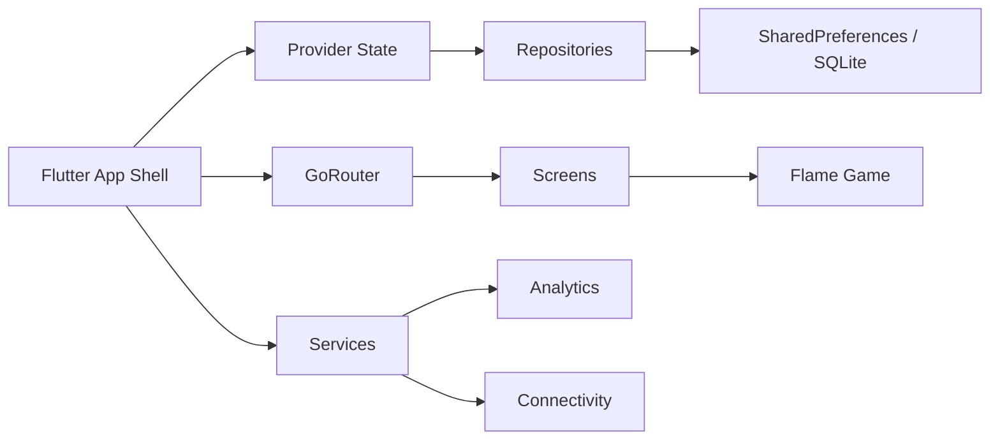

# Mice and Paws: Cat Game

[](https://github.com/BugraKaanSaglam/game_for_cats_flutter/actions/workflows/flutter_ci.yml)

<p align="center">
  
</p>

Colorful Flutter + Flame cat game built as a polished public portfolio project. This was my first app, so the repository is intentionally shaped to show both the product itself and how I approached architecture, testing, and iteration as I leveled up.

## Highlights

- Fast arcade loop built with `Flame`
- Localized UI in English and Turkish
- Persisted settings, onboarding, and play activity history
- Connectivity status layer with offline banner
- Typed internal analytics layer with event taxonomy
- Share flow for app info and game results
- Unit, widget, golden, and integration coverage
- GitHub Actions CI with coverage artifact output

## Repo Goals

This repo is deliberately built to read well for hiring managers and senior engineers reviewing public code:

- product thinking instead of toy-demo code
- clear growth from a first app into a maintainable codebase
- visible architecture boundaries
- explicit engineering decisions and tradeoffs
- offline-first observability and release posture
- automated regression safety

## Architecture Snapshot



## Feature Set

- Adjustable game timer, difficulty, audio, background image, mute, and low-power mode
- Onboarding flow with guarded initial navigation
- Activity trend screen backed by local session logs
- Credits and About screens with version/build metadata
- Connectivity banner for offline state awareness
- Share entry points for both app metadata and round results
- Cross-platform Flutter targets: Android, iOS, web, desktop shells

## Architecture

This project intentionally stays pragmatic.

- `lib/main.dart`: app bootstrap, routing, global error capture, providers
- `lib/state/`: application-level state via `provider`
- `lib/data/`: repository layer for settings and onboarding persistence
- `lib/services/`: app info, logging, sharing, connectivity, analytics
- `lib/views/screens/`: game-adjacent screens and product UI
- `lib/views/widgets/`: reusable presentation widgets
- `lib/models/`: entities, enums, DB models, global game variables
- `test/`: unit and widget coverage with shared test harness helpers
- `integration_test/`: routed app-flow smoke tests
- `docs/`: architecture, decisions, analytics, and release notes

Deep-dive docs:

- [Architecture](docs/ARCHITECTURE.md)
- [Engineering Decisions](docs/DECISIONS.md)
- [Analytics](docs/ANALYTICS.md)
- [Release And Config](docs/RELEASE_AND_CONFIG.md)

## Why `provider` Here?

`provider` is a deliberate choice for this repo. The app is still small-to-medium in state complexity, and the current architecture reads cleanly without introducing migration churn. If this project grows into heavier async data flows, backend integration, or feature modules, `riverpod` would be a strong next step.

## Quality

Local checks:

```bash
flutter pub get
flutter analyze
flutter test
flutter test --coverage
```

Integration smoke test on macOS:

```bash
flutter test integration_test -d macos
```

Or use the bundled shortcuts:

```bash
make quality
make coverage
make test-integration
make quality-full
```

Coverage output is generated at `coverage/lcov.info`.

If `genhtml` is installed, you can render a local HTML report:

```bash
genhtml coverage/lcov.info -o coverage/html
```

## CI

GitHub Actions runs on every push to `main`/`master` and on pull requests.

Pipeline steps:

1. `flutter pub get`
2. `dart format --set-exit-if-changed`
3. `flutter analyze`
4. `flutter test --coverage`
5. `flutter test integration_test -d macos`
6. upload `coverage/lcov.info` as an artifact

Workflow file: [.github/workflows/flutter_ci.yml](./.github/workflows/flutter_ci.yml)

## Running the App

```bash
flutter pub get
flutter run
```

## Test Inventory

Current automated coverage includes:

- model tests for `AppSettings`
- state tests for `AppState`
- service tests for connectivity handling
- widget tests for loading, credits, about, connectivity banner, and main menu navigation
- golden tests for stable UI snapshots
- integration smoke coverage for routed app flow

## Public Repo Goal

This repository is meant to present more than a toy app. It demonstrates:

- how I approached building my first app with increasing engineering rigor
- game loop integration
- product-focused UI layers outside the game canvas
- local persistence and settings design
- offline-first app observability basics
- CI and automated testing discipline

## Tradeoffs And Next Steps

Intentional tradeoffs in the current repo:

- `provider` over `riverpod` to avoid unnecessary migration churn
- lightweight analytics service instead of hard-coupling a backend SDK
- local-first persistence to keep setup and failure modes simple

Strong next steps if the app grows:

1. feature-package modularization
2. backend-backed analytics adapter
3. richer integration coverage on physical devices
4. design-system extraction for reusable UI primitives
