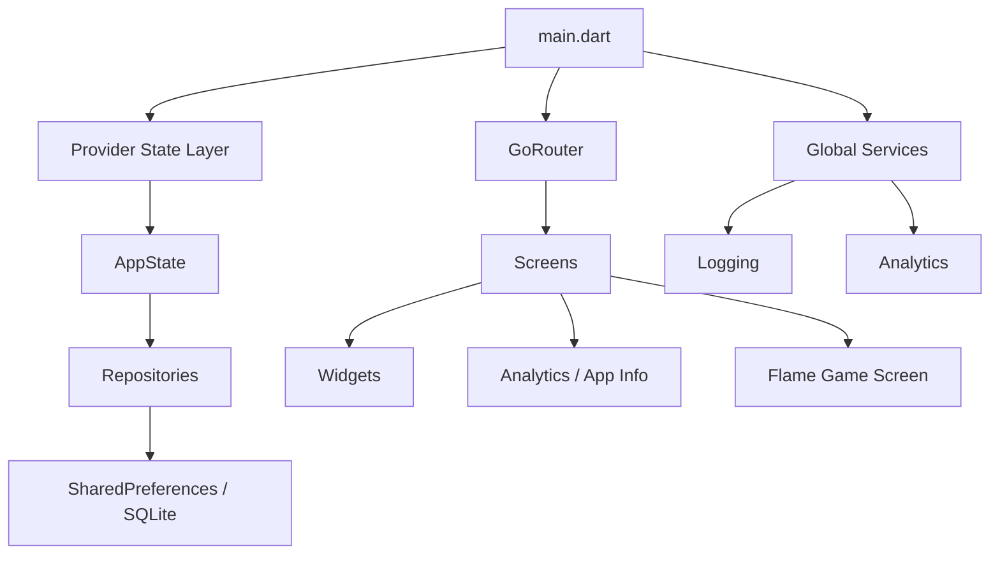

# Architecture

## Goal

This project is intentionally positioned between a playful game and a production-minded Flutter application. It is also my first app, so the surrounding product shell is structured to show how the codebase evolved beyond a simple starter project into something maintainable, testable, and portfolio-ready.

## High-Level System

## Layering

### App Bootstrap

- `lib/main.dart`
- wires providers, routing, localization, and theme

### State

- `lib/state/`
- `AppState` owns app readiness, onboarding completion, locale selection, and persisted settings

### Data / Persistence

- `lib/data/`
- repository layer keeps screen code away from storage details
- settings and onboarding use repositories; session history is stored via SQLite helper classes

### Services

- `lib/services/`
- contains cross-cutting runtime services:
  - `app_logger.dart`
  - `app_info_service.dart`
  - `app_analytics.dart`

### UI Shell

- `lib/views/screens/`
- screens outside the Flame canvas handle onboarding, settings, hunt journal, and game info

### Game Runtime

- `lib/views/screens/game_screen.dart`
- integrates `FlameGame`, overlays, streak tracking, and local session persistence

## State Management Choice

`provider` is used because the state graph is still compact and application-wide concerns are limited:

- app readiness
- settings
- onboarding completion

This keeps code readable and migration cost low. If the project grows into remote config, auth, content feeds, or feature-package isolation, `riverpod` becomes the more scalable option.

## Data Flow

1. `main.dart` starts providers and global services.
2. `AppState.initialize()` loads onboarding status and persisted settings.
3. router redirects onboarding users before main navigation becomes available.
4. screens render against `AppState`, repositories, and service abstractions.
5. the game screen records local play-session output to SQLite and surfaces activity history.
6. analytics and logs annotate major user flows.

## Observability

The app includes a deliberately small but structured observability surface:

- logging for boot and persistence flows
- analytics event taxonomy for major user interactions

## Testing Strategy

The repository uses three layers of automated verification:

- unit tests: models and state
- widget tests: key screens and navigation smoke
- golden tests: visual regressions for stable screens
- integration tests: app-flow smoke over routed UI

## Future Scaling Path

The next architecture steps, if this became a larger product, would be:

1. feature-based folders or packages
2. typed analytics backend adapter
3. environment-based config object instead of direct `dart-define` lookups
4. repository abstraction for remote services
5. move game/domain logic out of screen files into dedicated controllers/services
